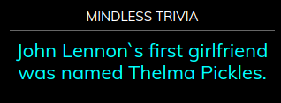

## MMM-TrivialAbyss

Mindless and trivial abyss of useless information. Cool though! :-)

## Why?

* Because

* Annotated .css file included for aligning and coloring text and header.



## Installation

* `git clone https://github.com/mykle1/MMM-TrivialAbyss` into the `~/MagicMirror/modules` directory.

* No API key needed! No dependenices needed! No kidding!


## Config.js entry and options
```
{
disabled: false,
module: 'MMM-TrivialAbyss',
position: 'top right',
config: {
    useHeader: true, // false if you don't want a header
    header: "Mindless Trivia", // Any text you want
    maxWidth: "300px",
    animationSpeed: 3000, // fade in and out speed
    updateInterval: 3 * 60 * 1000,
    }
},
```
